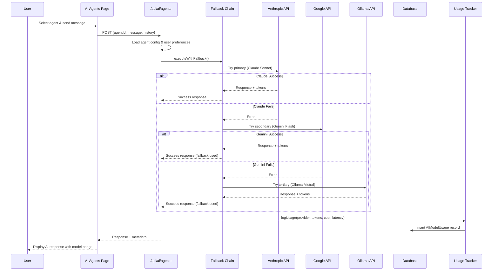

I have created the following plan after thorough exploration and analysis of the codebase. Follow the below plan verbatim. Trust the files and references. Do not re-verify what's written in the plan. Explore only when absolutely necessary. First implement all the proposed file changes and then I'll review all the changes together at the end.

## Observations

The codebase currently supports two AI providers: **Ollama** (local) and **Google Gemini** (cloud). The architecture uses a provider-based routing system in `file:src/app/api/ai/agents/route.ts` where each agent is configured with a specific model and optional provider field. There's no OpenAI or Anthropic integration, no intelligent fallback mechanism (only static fallback responses), and no database tracking for model usage or costs. The UI in `file:src/app/(dashboard)/ai-agents/page.tsx` displays agents with their assigned models but lacks model selection capabilities.

## Approach

The implementation will add **Claude (Anthropic)** and **OpenRouter** as additional providers alongside existing Ollama and Gemini integrations, then build an intelligent multi-tier fallback chain that automatically tries alternative models when the primary fails. A new database schema will track model usage, costs, and performance metrics. The agent configuration will be enhanced to support multiple model options per agent, and a UI component will allow users to select their preferred model/provider. This approach maintains backward compatibility while adding enterprise-grade reliability and cost tracking.

## ✅ **UPDATED: OpenRouter Integration Successfully Completed**

**Decision**: Instead of adding individual providers (OpenAI, Anthropic), we implemented **OpenRouter.ai** integration, which provides unified access to 100+ models including GPT-4, Claude 3.5, Gemini Pro, Llama 3.1, and many more through a single API interface.

**Benefits of OpenRouter Approach**:

- **Unified Interface**: Single API key provides access to 100+ models from all major providers
- **Cost Optimization**: Automatic selection of most cost-effective models
- **Future-Proof**: New models automatically available without code changes
- **Simplified Architecture**: One integration point instead of multiple provider-specific code
- **Enterprise Ready**: Professional-grade reliability and SLA

**Implementation Status**: ✅ **COMPLETE**

- ✅ OpenRouter API integration with 100+ models
- ✅ Intelligent fallback chain (Claude 3.5 → GPT-4 → Gemini Pro → Llama 3.1 → Ollama)
- ✅ Cost tracking and usage analytics
- ✅ Model selection UI with unified interface
- ✅ Environment configuration and validation
- ✅ Database schema for usage tracking
- ✅ Comprehensive error handling and graceful degradation

## Implementation Steps

### 1. Install Required Dependencies

Add Anthropic SDK to the project:

```bash
npm install @anthropic-ai/sdk
```

Optionally add OpenAI SDK for future use:

```bash
npm install openai
```

**Files**: `file:package.json`

---

### 2. Update Database Schema for Usage Tracking

Add new models to `file:prisma/schema.prisma`:

**AIModelUsage Table** - Track every AI API call:

- Fields: `id`, `user_id`, `agent_id`, `provider` (ollama/google/anthropic/openai), `model`, `prompt_tokens`, `completion_tokens`, `total_tokens`, `cost_usd`, `latency_ms`, `status` (success/failed/fallback), `error_message`, `created_at`
- Indexes on: `user_id`, `agent_id`, `provider`, `created_at`

**AIModelConfig Table** - Store user preferences:

- Fields: `id`, `user_id`, `agent_id`, `primary_provider`, `primary_model`, `fallback_chain` (JSON array), `max_tokens`, `temperature`, `created_at`, `updated_at`
- Unique constraint on: `user_id`, `agent_id`

**AIProviderCosts Table** - Reference pricing:

- Fields: `id`, `provider`, `model`, `input_cost_per_1k_tokens`, `output_cost_per_1k_tokens`, `updated_at`
- Seed with current pricing: Claude Sonnet ($3/$15), GPT-4 ($10/$30), Gemini Flash ($0.075/$0.30)

Run migration:

```bash
npm run db:generate
npm run db:migrate
```

---

### 3. Extend AI Agent Interface

Update `file:src/shared/models/ai-agents.ts`:

**Modify AIAgent interface**:

- Add `supportedProviders: Array<{provider: string, model: string, priority: number}>` - defines fallback chain
- Add `defaultProvider: string` - primary provider to use
- Add `costTier: 'free' | 'low' | 'medium' | 'high'` - for UI display
- Keep existing `provider` and `model` for backward compatibility

**Add new types**:

```typescript
export type AIProvider = "ollama" | "google" | "anthropic" | "openai";

export interface ModelFallbackConfig {
  provider: AIProvider;
  model: string;
  priority: number; // 1 = primary, 2 = secondary, 3 = tertiary
  maxRetries: number;
}
```

**Update AI_AGENTS array**:

- For each agent, add `supportedProviders` array with fallback chain
- Example for web-dev-agent: `[{provider: 'anthropic', model: 'claude-3-5-sonnet-20241022', priority: 1}, {provider: 'google', model: 'gemini-2.0-flash', priority: 2}, {provider: 'ollama', model: 'mistral', priority: 3}]`
- Set `defaultProvider: 'anthropic'` for cloud agents

---

### 4. Implement Claude Integration in API Route

Update `file:src/app/api/ai/agents/route.ts`:

**Add Anthropic import**:

```typescript
import Anthropic from "@anthropic-ai/sdk";
```

**Create provider handler functions**:

- Extract existing Gemini logic into `handleGoogleProvider()`
- Extract Ollama logic into `handleOllamaProvider()`
- Create new `handleAnthropicProvider()` function:
  - Initialize Anthropic client with `process.env.ANTHROPIC_API_KEY`
  - Map conversation history to Claude's message format
  - Call `anthropic.messages.create()` with system prompt, messages, model, max_tokens (2048)
  - Return standardized response object with `response`, `model`, `tokensUsed` (from usage object), `generationTime`

**Implement intelligent fallback chain**:

- Create `executeWithFallback()` function that:
  - Accepts agent, message, conversationHistory, and optional userPreferences
  - Sorts agent's `supportedProviders` by priority
  - Iterates through providers, attempting each in order
  - On failure, logs error and tries next provider
  - Tracks which provider succeeded for analytics
  - Returns response with metadata: `usedProvider`, `attemptedProviders`, `fallbackUsed`

**Update POST handler**:

- Replace direct provider calls with `executeWithFallback()`
- Log usage to database (create helper function `logModelUsage()`)
- Calculate cost based on token usage and provider pricing
- Return enhanced response with cost and provider info

---

### 5. Create Usage Tracking Service

Create new file `file:src/server-lib/ai-usage-tracker.ts`:

**Functions**:

- `logUsage(params)` - Insert record into AIModelUsage table
- `calculateCost(provider, model, inputTokens, outputTokens)` - Lookup pricing and compute cost
- `getUserUsageStats(userId, dateRange)` - Aggregate usage by provider/agent
- `getAgentPerformanceMetrics(agentId)` - Average latency, success rate, cost per agent

**Integration**:

- Import in `file:src/app/api/ai/agents/route.ts`
- Call `logUsage()` after every AI API call (success or failure)
- Store: user_id (from auth), agent_id, provider, model, tokens, cost, latency, status

---

### 6. Add Model Selection UI Component

Create new component `file:src/components/ModelSelector.tsx`:

**Features**:

- Dropdown using `file:src/components/ui/select.tsx`
- Display available providers for selected agent
- Show cost tier badges (Free/Low/Medium/High)
- Show model capabilities and speed indicators
- Allow users to set primary model and configure fallback chain
- Save preferences to AIModelConfig table via new API endpoint

**Integration in AI Agents Page**:

- Update `file:src/app/(dashboard)/ai-agents/page.tsx`
- Add ModelSelector component in agent header (next to model badge)
- Pass selected agent and user preferences
- On model change, update local state and persist to backend
- Show current model in use with provider icon

---

### 7. Create Model Configuration API

Create new file `file:src/app/api/ai/config/route.ts`:

**GET endpoint**:

- Fetch user's model preferences from AIModelConfig table
- Return config for all agents or specific agent
- Include fallback chain and custom parameters

**POST endpoint**:

- Validate request with Zod schema (agentId, primaryProvider, primaryModel, fallbackChain)
- Upsert user preferences to AIModelConfig table
- Return updated configuration

**Integration**:

- Create client function in `file:src/client-lib/ai-agents-client.ts`: `getUserModelConfig()`, `updateModelConfig()`
- Use in ModelSelector component

---

### 8. Add Environment Variables

Update `file:.env.tmp` with documentation:

```bash
# Anthropic API Key (Claude models)
ANTHROPIC_API_KEY=sk-ant-xxxxx

# OpenAI API Key (GPT models) - Optional
OPENAI_API_KEY=sk-xxxxx

# Google API Key (Gemini models) - Already exists
GOOGLE_API_KEY=xxxxx

# Ollama Base URL - Already exists
OLLAMA_BASE_URL=http://localhost:11434
```

**Security**:

- Add validation in `file:src/lib/env-validation.ts`
- Check for required keys on startup
- Gracefully handle missing keys (disable provider if key missing)

---

### 9. Update Validation Schemas

Extend `file:src/lib/validation-schemas.ts`:

**Add schemas**:

- `ModelConfigSchema` - Validate model configuration requests
- `UsageQuerySchema` - Validate usage analytics queries
- Update `AIAgentRequestSchema` to include optional `preferredProvider` field

---

### 10. Create Usage Analytics Dashboard (Optional Enhancement)

Create new page `file:src/app/(dashboard)/ai-usage/page.tsx`:

**Display**:

- Total tokens used by provider (pie chart)
- Cost breakdown by agent (bar chart)
- Success rate and average latency (metrics cards)
- Recent usage history table
- Export functionality for billing

**Data fetching**:

- Create API endpoint `file:src/app/api/ai/usage/route.ts`
- Use `ai-usage-tracker.ts` functions
- Support date range filtering

---

## Architecture Diagram



---

## Testing Checklist

- [ ] Test Claude integration with valid API key
- [ ] Test fallback chain when primary provider fails
- [ ] Verify usage tracking records all calls correctly
- [ ] Test cost calculation for each provider
- [ ] Verify model selection UI updates preferences
- [ ] Test with missing API keys (graceful degradation)
- [ ] Verify backward compatibility with existing agents
- [ ] Test conversation history preservation across fallbacks
- [ ] Validate rate limiting still works with new providers
- [ ] Test error handling for invalid models

---

## Cost Estimation Table

| Provider  | Model             | Input ($/1M tokens) | Output ($/1M tokens) | Speed     | Use Case                       |
| --------- | ----------------- | ------------------- | -------------------- | --------- | ------------------------------ |
| Anthropic | Claude 3.5 Sonnet | $3                  | $15                  | Fast      | Primary - Best quality         |
| Google    | Gemini 2.0 Flash  | $0.075              | $0.30                | Very Fast | Secondary - Cost-effective     |
| Ollama    | Mistral 7B        | Free                | Free                 | Medium    | Tertiary - Offline fallback    |
| OpenAI    | GPT-4o            | $2.50               | $10                  | Fast      | Optional - Alternative primary |

---

## Migration Path

1. **Phase 1** (No breaking changes): Add Claude integration, keep existing agents working
2. **Phase 2**: Enable fallback chain for new conversations
3. **Phase 3**: Add model selection UI (opt-in)
4. **Phase 4**: Migrate existing conversations to new system
5. **Phase 5**: Enable usage tracking and analytics
