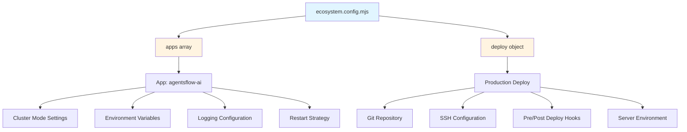

I have created the following plan after thorough exploration and analysis of the codebase. Follow the below plan verbatim. Trust the files and references. Do not re-verify what's written in the plan. Explore only when absolutely necessary. First implement all the proposed file changes and then I'll review all the changes together at the end.

## Observations

The `file:ecosystem.config.cjs` file uses CommonJS syntax (`module.exports`) but your `file:package.json` declares `"type": "module"` (line 5), causing Node.js 24.x to misinterpret the module system. The file contains comprehensive PM2 configuration for the Next.js application including cluster mode settings, logging, deployment configuration, and detailed documentation comments. All configuration properties and comments must be preserved during the conversion.

## Approach

Convert the PM2 ecosystem configuration from CommonJS to ES module syntax by renaming the file extension and updating the export statement. This aligns with the project's ES module configuration and resolves the syntax error. The conversion is straightforward: change `module.exports = { ... }` to `export default { ... }` while maintaining all existing configuration properties, environment variables, deployment settings, and documentation.

## Implementation Steps

### 1. Rename Configuration File

Rename `file:ecosystem.config.cjs` to `ecosystem.config.mjs` to explicitly declare it as an ES module file.

### 2. Convert Module Syntax

In the newly renamed `ecosystem.config.mjs` file:

**Line 15**: Replace the CommonJS export syntax:
```javascript
module.exports = {
```

With ES module export syntax:
```javascript
export default {
```

**Important**: Keep the closing brace and semicolon on line 95 unchanged.

### 3. Update Internal File References

Within `ecosystem.config.mjs`, update all self-referencing comments that mention the old filename:

- **Line 5**: Change `pm2 start ecosystem.config.cjs` to `pm2 start ecosystem.config.mjs`
- **Line 6**: Change `pm2 reload ecosystem.config.cjs` to `pm2 reload ecosystem.config.mjs`
- **Line 7**: Change `pm2 stop ecosystem.config.cjs` to `pm2 stop ecosystem.config.mjs`
- **Line 8**: Change `pm2 delete ecosystem.config.cjs` to `pm2 delete ecosystem.config.mjs`
- **Line 11**: Change `pm2 deploy ecosystem.config.cjs production setup` to `pm2 deploy ecosystem.config.mjs production setup`
- **Line 12**: Change `pm2 deploy ecosystem.config.cjs production` to `pm2 deploy ecosystem.config.mjs production`
- **Line 62**: Change `pm2 deploy ecosystem.config.cjs production setup` to `pm2 deploy ecosystem.config.mjs production setup`
- **Line 65**: Change `pm2 deploy ecosystem.config.cjs production` to `pm2 deploy ecosystem.config.mjs production`
- **Line 85**: Change `pm2 reload ecosystem.config.cjs` to `pm2 reload ecosystem.config.mjs`

### 4. Verification Checklist

After conversion, verify that:

- ✅ File extension is `.mjs`
- ✅ Export statement uses `export default` syntax
- ✅ All configuration properties remain unchanged:
  - `apps` array with PM2 settings (lines 16-51)
  - `deploy` object with production configuration (lines 67-94)
- ✅ All comments and documentation preserved
- ✅ All internal filename references updated
- ✅ Environment variables intact (`env_production`, `env`)
- ✅ Logging paths unchanged
- ✅ SSH options and deployment commands preserved

### 5. Test the Configuration

After making changes, test the configuration:

```bash
# Validate PM2 can parse the new config
pm2 start ecosystem.config.mjs --env production

# Verify the application starts correctly
pm2 status

# Check logs for any errors
pm2 logs agentsflow-ai
```

## Configuration Structure

