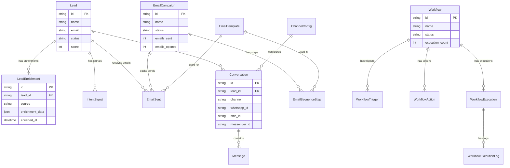

# Prisma Schema Changes Documentation

This document describes the schema extensions added to support Lead Enrichment, Email Campaigns, Workflow Automation, and Multi-Channel features.

## Schema Extensions Summary

### Lead Enrichment

Three new tables for storing external API data and tracking lead behavior:

| Table                | Description                                                                      |
| -------------------- | -------------------------------------------------------------------------------- |
| `lead_enrichments`   | Stores data from external enrichment APIs (People Data Labs, Forager, CrustData) |
| `enrichment_sources` | Configuration for enrichment API providers                                       |
| `intent_signals`     | Tracks lead behavior signals (website visits, email opens, etc.)                 |

**Key Fields:**

- `lead_enrichments.enrichment_data` (JSON) - Full API response data
- `lead_enrichments.confidence_score` - Data quality indicator
- `lead_enrichments.tech_stack` / `skills` - Extracted arrays
- `intent_signals.score_impact` - Positive/negative signal weight

**Relationships:**

```
Lead ||--o{ LeadEnrichment : "has enrichments"
Lead ||--o{ IntentSignal : "has signals"
```

### Email Campaigns

Four new tables for automated email sequences with full tracking:

| Table                  | Description                             |
| ---------------------- | --------------------------------------- |
| `email_campaigns`      | Campaign metadata and statistics        |
| `email_templates`      | Reusable email templates with variables |
| `email_sequence_steps` | Step definitions in a campaign sequence |
| `emails_sent`          | Individual email sends with tracking    |

**Key Fields:**

- `email_templates.variables` - Template variable list (e.g., `['name', 'company']`)
- `email_sequence_steps.delay_hours` - Delay between steps
- `emails_sent.tracking_id` - Unique ID for open/click tracking
- `emails_sent.status` - Full lifecycle tracking

**Relationships:**

```
EmailCampaign ||--o{ EmailSequenceStep : "has steps"
EmailCampaign ||--o{ EmailSent : "tracks sends"
EmailTemplate ||--o{ EmailSequenceStep : "used in"
EmailTemplate ||--o{ EmailSent : "used for"
Lead ||--o{ EmailSent : "receives emails"
```

### Workflows

Five new tables for no-code automation engine:

| Table                     | Description                               |
| ------------------------- | ----------------------------------------- |
| `workflows`               | Workflow definitions and statistics       |
| `workflow_triggers`       | Trigger configurations                    |
| `workflow_actions`        | Action definitions with branching support |
| `workflow_executions`     | Execution instances                       |
| `workflow_execution_logs` | Execution audit trail                     |

**Key Fields:**

- `workflow_trigger.trigger_config` - Conditions, filters, schedules
- `workflow_action.action_config` - Parameters for each action type
- `workflow_action.parent_action_id` - Branching logic support
- `workflow_execution_log.duration_ms` - Performance metrics

**Relationships:**

```
Workflow ||--o{ WorkflowTrigger : "has triggers"
Workflow ||--o{ WorkflowAction : "has actions"
Workflow ||--o{ WorkflowExecution : "has executions"
WorkflowExecution ||--o{ WorkflowExecutionLog : "has logs"
```

### Multi-Channel

Extended existing models and added new configuration:

**Conversation Model Extensions:**

- `whatsapp_id` - WhatsApp conversation ID
- `sms_id` - Twilio SMS conversation ID
- `messenger_id` - Facebook Messenger conversation ID
- `instagram_id` - Instagram DM conversation ID
- `channel_metadata` - Channel-specific data

**New Table:**

| Table             | Description                              |
| ----------------- | ---------------------------------------- |
| `channel_configs` | Provider configurations for each channel |

**Channel Types Supported:**

- `whatsapp` (Twilio)
- `sms` (Twilio)
- `messenger` (Facebook)
- `instagram` (Facebook)
- `email` (SendGrid)

## Key Design Decisions

1. **JSON Fields** - Used for flexible nested data (enrichment_data, trigger_config, action_config)
2. **Separate Tracking Tables** - EmailSent and WorkflowExecutionLog for audit trails
3. **Nullable Foreign Keys** - For optional relationships
4. **Indexes** - Created on frequently queried fields (lead_id, status, created_at)
5. **Enum-based Status Fields** - For type safety and valid values

## Migration Commands

```bash
# Development
npm run db:push        # Push schema changes (skips migrations)
npm run db:seed        # Seed sample data

# Production
npm run db:migrate     # Apply migrations only

# Tools
npm run db:studio      # Open Prisma Studio
npx prisma validate    # Validate schema syntax
npx prisma format      # Format schema
```

## Rollback Strategy

If issues occur with `db:push`:

```bash
# Reset database (WARNING: deletes all data)
npx prisma db push --force-reset

# Or use migrate rollback (if using migrations)
npx prisma migrate resolve --rolled-back <migration_name>
```

## Architecture Diagram



## Summary Table

| Feature Group   | Tables Added                                                                       | Key Relationships                                 | JSON Fields                                   |
| --------------- | ---------------------------------------------------------------------------------- | ------------------------------------------------- | --------------------------------------------- |
| Lead Enrichment | LeadEnrichment, EnrichmentSource, IntentSignal                                     | Lead → LeadEnrichment (1:N)                       | enrichment_data, social_profiles, signal_data |
| Email Campaigns | EmailCampaign, EmailTemplate, EmailSequenceStep, EmailSent                         | Campaign → Steps → Template, Campaign → EmailSent | target_audience, metadata                     |
| Workflows       | Workflow, WorkflowTrigger, WorkflowAction, WorkflowExecution, WorkflowExecutionLog | Workflow → Triggers/Actions, Execution → Logs     | trigger_config, action_config, trigger_data   |
| Multi-Channel   | ChannelConfig, Extended Conversation                                               | ChannelConfig → Conversation                      | api_credentials, channel_metadata             |

## Validation Schemas

Zod validation schemas are available in `src/lib/validation-schemas.ts`:

- `LeadEnrichmentCreateSchema`
- `IntentSignalCreateSchema`
- `EmailCampaignCreateSchema` / `EmailCampaignUpdateSchema`
- `EmailTemplateCreateSchema`
- `EmailSequenceStepCreateSchema`
- `WorkflowCreateSchema` / `WorkflowUpdateSchema`
- `WorkflowTriggerCreateSchema`
- `WorkflowActionCreateSchema`
- `ChannelConfigCreateSchema`

## TypeScript Types

TypeScript interfaces are available in `src/shared/models/types.ts`:

- `LeadEnrichment`
- `EnrichmentSource`
- `IntentSignal`
- `EmailCampaign`
- `EmailTemplate`
- `EmailSequenceStep`
- `EmailSent`
- `Workflow`
- `WorkflowTrigger`
- `WorkflowAction`
- `WorkflowExecution`
- `WorkflowExecutionLog`
- `ChannelConfig`
